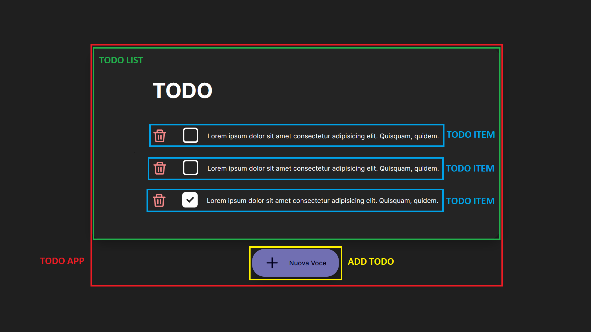
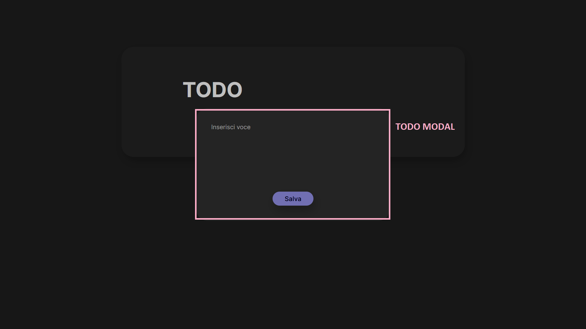

# To Do List

This is a simple To Do list project.

This project was built with:

## Features

- <b>Adding</b> a Todo

- <b>Marking</b> a Todo as done or not

- <b>Deleting</b> Todo

- Todos are saved in <b>local storage</b>

- <b>Marked todos</b> are saved at the bottom and have a <s>strikethrough</s> on them.

## Component Heirarchy

- Todo App
  - Todo Modal
  - Todo List
    - Todo Item
  - Add Todo

## Project Duration

The total project duration was about 12 hours.
